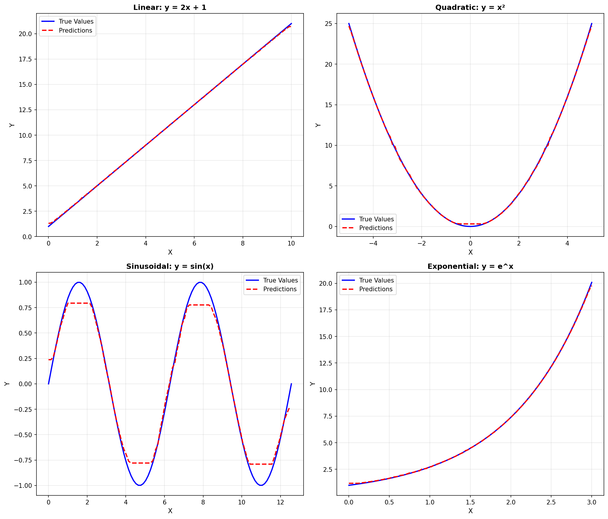

# StatQuest's Machine Learning

This repository follows [StatQuest's](https://www.youtube.com/@statquest) videos about machine learning. To help me learn the models better, I decided to code the models entirely based on the videos. 

## Local Usage

If for some reason you wanna try this code yourself, please ensure that you have Python 3.13 and `uv` installed. After cloning the repository, enter the repository within your terminal and use `uv sync` to get all the necessary libraries. 

## Dependencies List
You may check the dependencies for yourself in the [pyproject.toml file](https://github.com/RicePandaaaa/StatQuest_MachineLearningModels/blob/main/pyproject.toml). For convenience, the table below lists the dependencies and why they are used:

| Resource | Reason for Usage |
| :-------- | :------- |
| pandas | High potential to use `Dataframe`, comes with `numpy` |
| matplotlib | Visualizes data in a graph, primarily for comparison and error graphs | 

## XGBoost Regression

XGBoost itself is not necessarily confined to just regression, but there is a video that explains how the regression trees work. With that video, I decided to make the basic tree and a simple regression model.

| Resource | Link |
| :-------- | :------- |
| Reference Video | https://www.youtube.com/watch?v=OtD8wVaFm6E |
| Code | https://github.com/RicePandaaaa/StatQuest_MachineLearningModels/blob/main/xgboost/ |
| Comparison + Error Graphs| https://github.com/RicePandaaaa/StatQuest_MachineLearningModels/tree/main/testing_suite_results/xgboost_regression |

Comparison (predicted vs true values) Graph:

